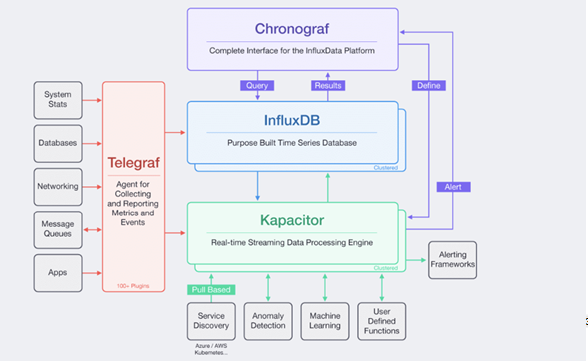

# TICK stack

TICK stack is a tập hợp của các sản phầm opensoucre của InfluxData phục vụ giám sát hệ thống máy chủ, là tập hợp của 4 project:

* Telegraf : vai trò thu thập time-series data từ nhiều nguồn khác nhau: ví dụ như tài nguyên server, các cuộc gọi API, dịch vụ hệ thống , truy vấn DB, SMNP. 
* InfluxDB : vai lưu trữ time-series data.
* Chronograf : vai trò trình diễn, hiển thi trực quan các thông số truy vấn từ influxDB thành bảng biểu. 
* Kapacitor:  vai trò xử lý time-series data và cảnh báo cho người dùng, qua các kênh như email, telegram messenger

Kiến trúc của TICK- stack được mô tả như hình 2.4, tham khảo từ nguồn [1]

Vai trò của TICK trong giám sát:  

TICK để giám sát cho các máy chủ vật lý, phục vụ nhu cầu của nhà cung cấp dịch vụ cloud. Từ TICK có thể biết được trạng thái tài nguyên và dịch vụ của các máy chủ. Đặc biêt đề đảm bảo hoạt động của openstack ta cần chú ý đến:
 
* Hoạt động của máy vật lý: ram, cpu, card mạng , disk
* Dịch vụ thuộc dự án openstack như nova, cinder, glance, neutron, heat
* Mysql
* Rabbit MQ
* Memcached
* Các máy ảo ( mà có quyền cài telegraf agent lên)

