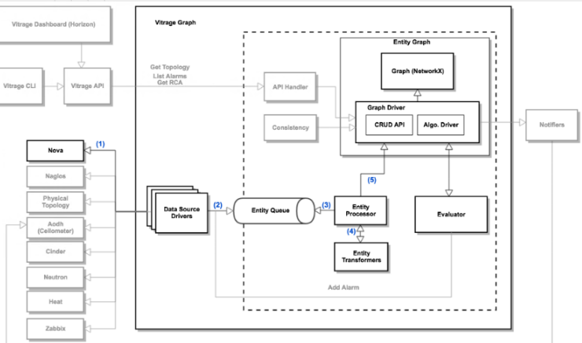
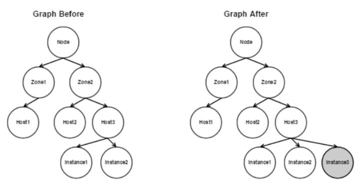
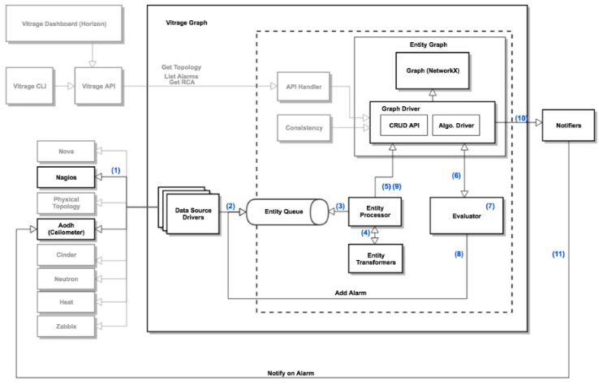

# Tổng quan về Vitrage
## Khái niệm

 Vitrage - OpenStack RCA (Root Cause Analysis) là dịch vụ giúp tổ chức, phân tích, các alarm, event xảy đến với hệ thống, nhằm làm rõ được những alarm này có nguồn gốc từ đâu và có thể gây ảnh hưởng thế nào.
 
Vitrage có các use-case tổng quan:

- Holistic and complete view: vitrage có thể biểu diễn mỗi quan hệ logic của các tài nguyên trong hệ thống thành grap+topology cho người xem, bao gồm cả thực thể virtual (instance, port, zone,..) hay physical (host , switch,..) kết nối với nhau. Để khi có một alarm xuất hiện từ một thành phần ta giải thích được nó sẽ ảnh hưởng tới thành phần khác như thế nào.
- Deduced alarm, state: mục đích nhắm tới là đưa ra cảnh báo về một thành phần hệ thống, ngay trước cả khi nó được phát hiện trực tiếp bởi hệ thống monitor. Nhấn mạnh vào yếu tố “suy luận” để bật một deduced alarm :  
Ví dụ: 
*Khi switch tới host gặp vấn đề, khiến ngay các instance nối với host đó cũng không monitor được,  vitrage có thể đưa ra cảnh báo với insance. 
*Trong mô hình HA cho một dịch vụ trên 3 VM mà cả 2 VM đều lỗi, thì vm còn lại cần bật warning 
*Bật warning trên vm khi thấy không đủ host để migrate nếu cần. 
- Root Cause Indicators: biểu diễn quan hệ nguyên nhân-kết quả giữa các alarm. Vitrage đọc các luật người dùng định nghĩa, xem xem có thể áp dụng luật nào vào trạng thái hiện tại và đưa các liên kết “causual” vào biểu đồ. Giúp cho việc tìm ra nguồn kích hoạt gốc của cho các alarm. 

## Kiến trúc

- Vitrage bao gồm các thành phần:
  - ClI, Drashboard, API: nhận yêu cầu người dùng, gọi đến các thành phần khác.
Vitrage data source driver: Nhiệm vụ lấy input đầu vào thông tin về các resource hệ thống về cho vitrage graph hiển thị. Dữ liệu bao gồm thông tin như: resource có các thực thể nào? quan hệ giữa các thực thể đó. Vd: thực thể trong aodh là “alarm”, của nova là “zone” chứa “host” chứa “instance”. Các datasoucrce gồm:  
từ nguồn openstack : aodh, ceilometer, cinder, heat, neutron, nova. 
từ nguồn extenal monitor, gồm: collectd, zabix, nagios, doctor. 
static datasource: đọc thông tin từ các file cấu hình người dùng cấp 
( trên là từ bản pike-queens, bản rocky có thêm kubernetes và prometheus)
  - Vitrage graph: Giữ các thông tin từ datasouce và trình diễn nó ra, đồng thời cũng lấy cập nhật của khối evaluator khi có. Driver để vẽ đồ thị là networkX , đồng thời cũng inplement môt số phép xử lý đồ thị khi được gọi, vd duyệt, tìm đỉnh, cạnh…
  - Vitrage evaluator:  Khi có thông báo từ graph về một số thay đổi của các thực  thể, nó truy vấn trong các kịch bản (*template* do người dùng định nghĩa từ trước) và áp dụng các thay đổi trạng thái cho các thực thể  (set_state, raise_alarm, add_causual_relationship)
  - Vitrage notifiers: có nhiệm vụ thông báo cho các thành phần khác về các thay đổi trong trang thái hệ thống, áp dụng các action lên các dịch vụ đó. Hiện có các plugin cho: aodh, nova, mistral ; snmp, webhook.  
Theo default khi mới cài đặt, chưa có plugin nào áp dụng.
  - Vitrage machine leaning: Thiết kế ra nhằm giúp vitrage có thể: xem xét từ các alarm , deduce-alarm đã xuất hiện, tính rra sự liên quan giữa các alarm, gợi ý cho người dùng viết các template mới.
  
## Các luồng hoạt động cơ bản

- Trường hợp thêm một instance mới: 
1. Nova tạo thêm instance , gửi thông báo lên rabbitmq topic “vitrage_notifications”. Nova-datasouce driver nhận thông báo.  
2. Nova-datasource Driver gửi thông tin vào vitrage entity queue ( bản chất queue này không phải message queue mà đơn giản là một mảng bình thường) 
3. Entity processor polling event từ entity queue, xác định thông tin của thực thể cần thêm  
4. Entity trasformers chuyển thông tin của thực thể về các đối tượng trong graph: đỉnh, cạnh, neghbors,...  
5. Entity processor gọi graph api thêm đỉnh, cạnh mới. 

- Trường hợp thêm có một alarm : 
Khi phát hiện switch down, vitrage nhận được alarm từ nagios. Thiết lập kịch bản sẽ thực hiện là: tạo deduce-alarm trên các host gắn với switch, các instance gắn trên host và triger lại cho aodh.  

Alarm về bản chất cũng là 1 entity nên các bước từ 1 đến 5 cũng giống như use case trên. vd thêm 1 entiry có type alarm thông báo switch mà host 1 attach bị down  
6. Khi có bất kỳ thay đổi nào về graph thì evaluator cũng được gọi đến. Evaluator biết được có 1 đỉnh mới được add 
7. Evaluator xem xét các template đã có thì thấy có 1 kịch bản cần áp dụng: bật deduce-alarm error trên mỗi instance gắn với host đó.  
8. Evaluator push alarm vào entity queue. 
9. Graph update thêm các alarm mới  
10. Graph thêm thông báo rằng có 1 alarm mới trên instance, đẩy thông báo này vào messasge queue  
11. Vitrage Notifier định nghĩa alarm cho aodh - set state “alarm”  

# Installation Guide

[install vitrage](install.md)
# Configuration Guide

[entity graph](entity_graph.md)

# Referent

https://wiki.openstack.org/wiki/Vitrage

https://docs.openstack.org/vitrage/ocata/vitrage-use-cases.html
