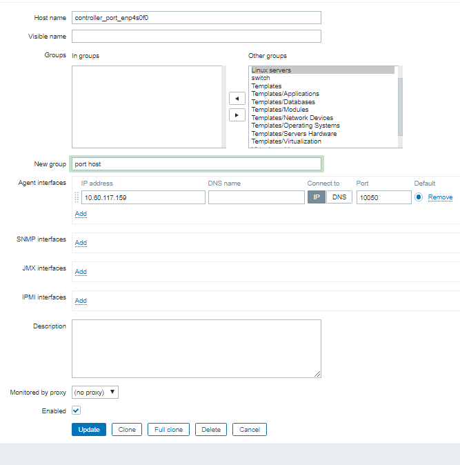
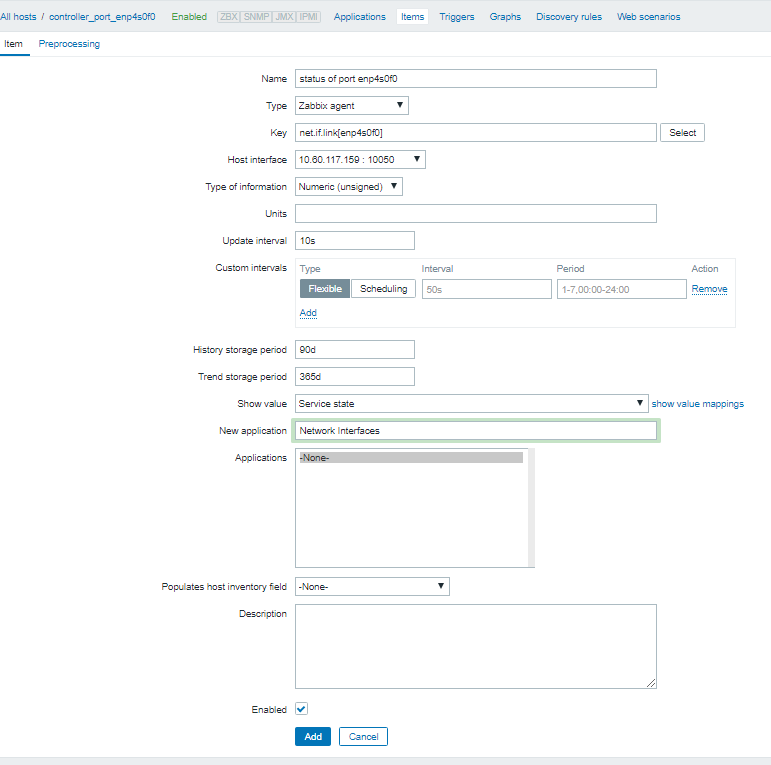
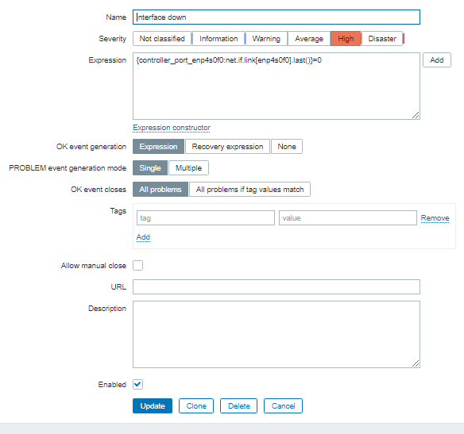

### Cấu hình zabbix để nhận cảnh báo về 1 interface của host down:
- 1. Thêm file trên mỗi host chạy zabbix agent:

```
cat > /etc/zabbix/zabbix_agentd.d/userparameter_niclink.conf << EOF
UserParameter=net.if.link[*], if [ $(cat /sys/class/net/$1/operstate) = "up" ]; then cat /sys/class/net/$1/carrier; else echo "0"; fi;
EOF
service zabbix-agent restart
```

- 2.Tại zabbix UI, thêm host : vào Configuration > host > create host

- 3.Tại Zabbix UI, tạo item của host vửa tạo :
  - Type: Zabbix agent 
  - Key:  net.if.link[*] thay * bằng tên port cần monitor , vd net.if.link[enp4s0f0]
  - Type of information: Numeric (unsigned); Data type: Decimal
  - Show Value: as "Service state" (displays them as "Up/Down")
  - Application: Network Interfaces


- 4.Tạo triger:
  - Name: interface down
  - Severity: High
  - Expression: {controller_port_enp4s0f0:net.if.link[enp4s0f0].last()}=0 với controller_port_enp4s0f0:net.if.link[enp4s0f0] là item thêm ở trên . bật trigger khi giá trị bằng 0


