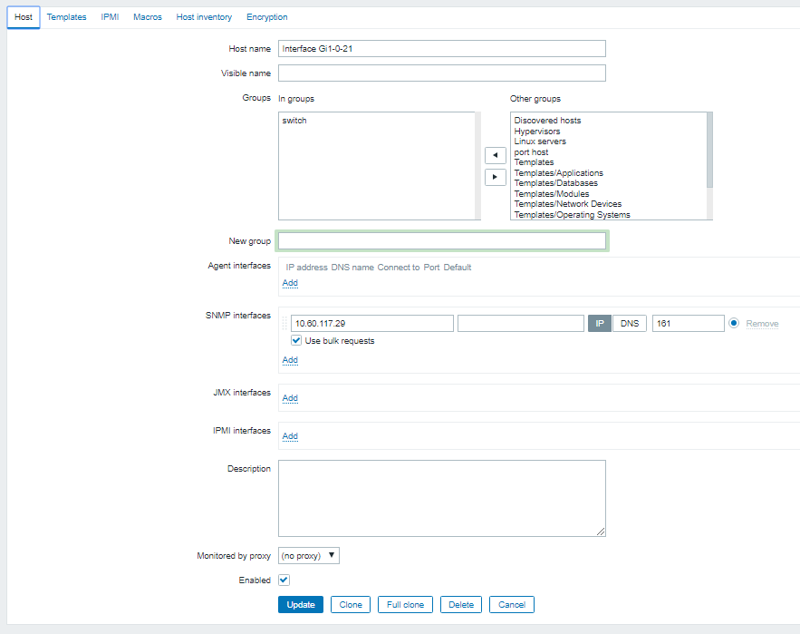
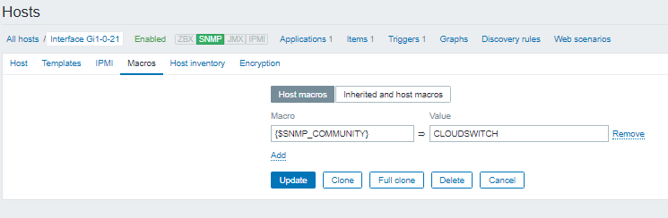
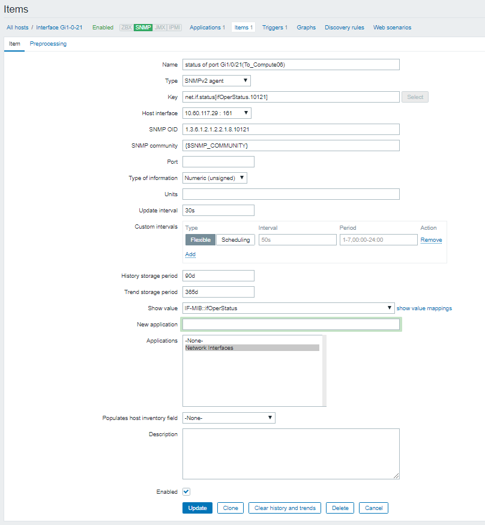
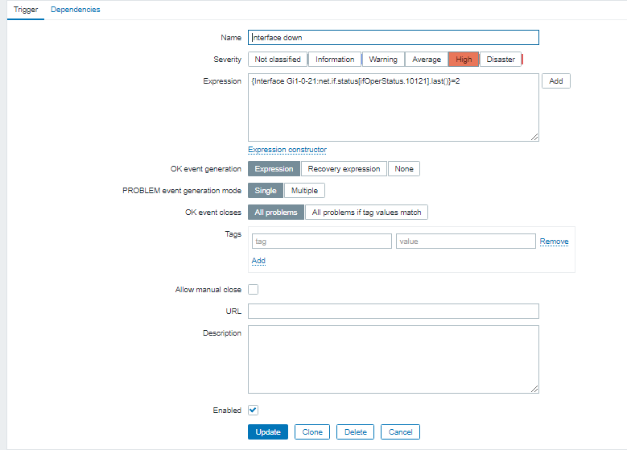

### Cấu hình zabbix để nhận cảnh báo về 1 interface của switch down:

- 1.Tại zabbix UI, thêm host : vào Configuration > host > create host  
Thông tin cơ bản  

Thiết lập SNMP_COMMUNITY tại tab Macros

- 2.Tạo item của host vửa tạo :
  - Type: SNMP2 agent 
  - Key:  net.if.status[ifOperStatus.*] thay * bằng tên oid port cần monitor , vd net.if.status[ifOperStatus.10121]
  - Type of information: Numeric (unsigned); Data type: Decimal
  - Show Value: IF-MIB::ifOperStatus
  - Application: Network Interfaces

- 4.Tạo trigger:
  - Name: interface down
  - Severity: High
  - Expression: 
  {Interface Gi1-0-21:net.if.status[ifOperStatus.10121].last()}=2  
với Interface Gi1-0-21:net.if.status[ifOperStatus.10121] là item thêm ở trên . bật trigger khi giá trị bằng 2

