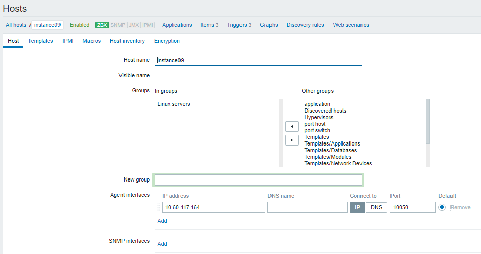
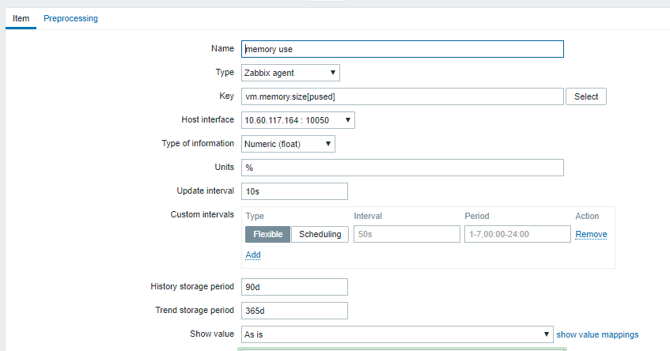
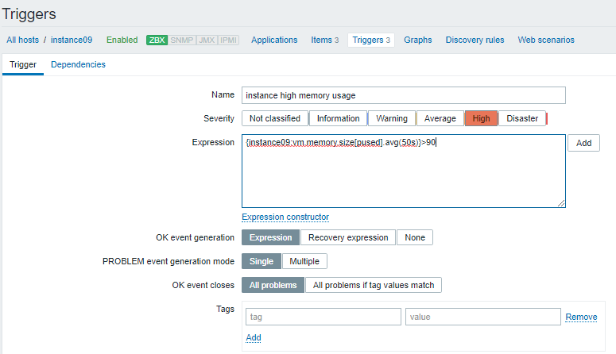
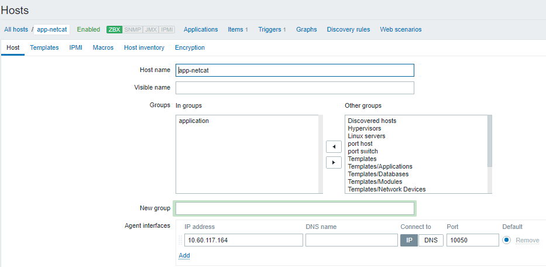
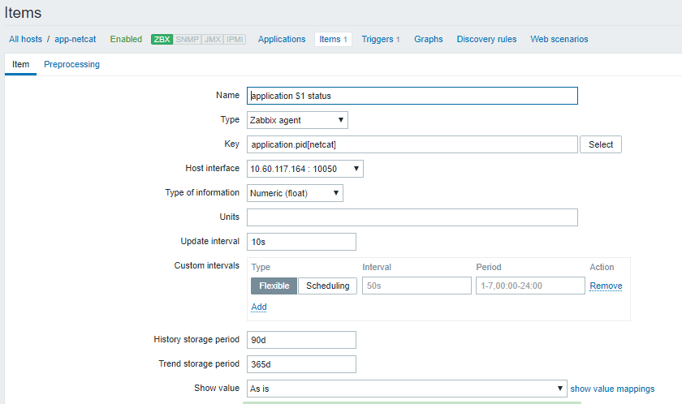
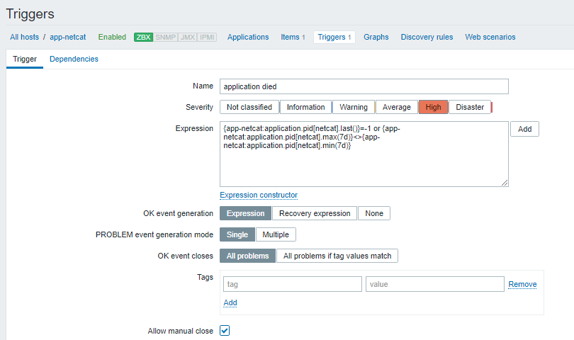
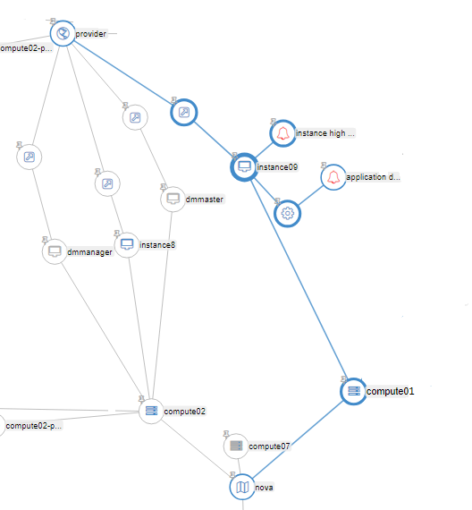
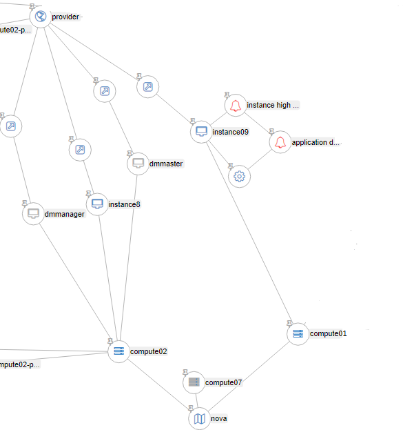

# Nội dung kịch bản

Đầu vào monitor:

- Memory của VM (qua aodh hoặc zabbix, tick)
- Application(s) của VM (theo appname)

Kịch bản: xuất hiện các alarm

- Alarm 1: Memory của VM cao: Nếu % Mem của VM > 90%, hoặc % CPU của VM cao > 95% trong vòng 5 phút

- Alarm 2: Application(s) die: <br/>
  Nếu app không chạy <br/>
  Hoặc application ID bị đổi (do có 1 tiến trình trên VM monitor application, nếu application bị tắt thì tiến trình monitor sẽ bật lại => bị đổi PID)

Yêu cầu:

- Collect được alarm khi xảy ra (zabbix hoặc telemetry) đẩy cho vitrage

- Vitrage nhân định Alarm 1 => Alarm 2

- Vitrage gọi đến mitral thực hiện auto scaling (optional)

# Thực hiện
## Chuẩn bị monitor các thành phần:

Ở đây cần monitor instance memory và instance application. Lựa chọn zabbix lấy alarm.

- Đầu tiên cần cài đặt zabbix agent cho mỗi instance. Các agent này cần gửi thông tin thu thập cho một zabbix server cài trên 1 host, mà host đó vitrage có thể kết nối được
- Trên UI của zabbix server, ta cấu hình để monitor memory và application như sau:
- (*) Monitor instance memory: 
  - Ứng với mỗi instance tạo 1 zabbix host tương ứng
    - Hostname: tên instance.
    - Agent interface: interface của instance, kết nối zabbix server và agent
    - 
  - Tạo item để thu thập thông tin memory của instance
    - Vào tab Configuration > host > [instance09] > item > create item 
      - Key: vm.memory.size(pushed) <br/>
       (Key này mang ý nghĩa:   % (active + wired) / total memory) <br/>
       Tham khảo tại: https://www.zabbix.com/documentation/3.2/manual/appendix/items/vm.memory.size_params
      - 
  - Tạo trigger cảnh báo : khi mem dùng của instance vượt quá 90% thì bắn alarm
    - Vào tab: Configuration > host > [instance09] > Triggers > create trigger
    - 
    - Ở đây avg(50s) tức nó sẽ xem xét giá trị trung bình trong khoảng 50s. Nếu cần trong 5 phút giá trị này cần đặt 1500
- (*)Monitor instance application:
  - Ta nhận biết application chết bằng cách kiểm tra có sự thay đổi pid không.
  - Tạo host: ứng với mỗi application tạo 1 zabbix host: <br/>
       Giả sử app ta muốn monitor là netcat <br/>
       
  - Lấy thông tin pid: thêm user parameter: <br/>
      Tạo file
        
    !!! note "/etc/zabbix/zabbix_agentd.d/userparameter_application.conf"
    
        UserParameter=application.pid[*],if [ "$(pidof $1)" = "" ]; then echo "-1"; else echo $(pidof $1); fi;
        

      - Vào tab Configuration > host > [instance09] > item > create item <br>
        với key: appication.pid.[*] thay * bằng tên process muốn monitor
        
  - Tạo trigger cảnh báo : khi app không chạy hoặc application pid bị đổi thì bắn alarm <br/>
     - application.pid [*] = -1 
     - OR application.pid [*].max(7d) <> application.pid [*].min(7d)
     - 

## Cấu hình vitrage
- Map các alarm vào đồ thị:
  - Thêm entity app vào đồ thị, vd ta muốn thêm monitor vào 1 app “netcat”
  - Tạo file /etc/vitrage/static_datasources/app-netcat.yaml nội dung:
 
!!! note "app-netcat.yaml"

    ```---
    metadata:
      name: list of application run on instance
      description: list of application run on instance
    definitions:
      entities:
       - static_id: app-netcat
         type: application
         id: app-netcat
         state: available
       - static_id: instance9
         type: nova.instance
         id: eff1daed-0d97-4975-abbd-3d3e907aeedf
      relationships:
       - source: instance9
         target: app-netcat
         relationship_type: run
    ```
   
  - mapping cho alarm của zabbix vào đồ thị: <br/>
    Thêm vào file /etc/vitrage/zabbix_conf.yaml

!!! note "zabbix_conf.yaml"
  
    ```---
    - zabbix_host: instance09
      type: nova.instance
      name: eff1daed-0d97-4975-abbd-3d3e907aeedf
    - zabbix_host: app-netcat
      type: application
      name: app-netcat
    ```

  - Vậy ta đã chuẩn bị xong mô hình input, kết quả: <br/>
  - 
  - Cấu hình root-cause-analys:
  - Thêm template <br/>
    Tạo file template /etc/vitrage/templates/usecase-1.yaml

!!! note "usecase-1.yaml"
    
    ```---
    metadata:
      name: rca application died caused by high mem on instance
      description: rca application died caused by high mem on instance
    definitions:
      entities:
          - entity:
              template_id: alarm_high_memory_used
              category: ALARM
              name: instance high memory usage
          - entity:
              template_id: alarm_application_died
              category: ALARM
              name: application died
          - entity:
              template_id: instance
              category: RESOURCE
              type: nova.instance
          - entity:
              template_id: application
              category: RESOURCE
              type: application
      relationships:
          - relationship:
              template_id : alarm_high_memory_on_instance
              source: alarm_high_memory_used
              target: instance
              relationship_type: on
          - relationship:
              template_id : alarm_application_died_on_applicaion
              source: alarm_application_died
              target: application
              relationship_type: on
          - relationship:
              template_id : instance_run_application
              source: instance
              target: application
              relationship_type: run
    scenarios:
        - scenario:
            condition: alarm_high_memory_on_instance and alarm_application_died_on_applicaion and instance_run_application
            actions:
                - action:
                    action_type : add_causal_relationship
                    action_target:
                      source: alarm_high_memory_used
                      target: alarm_application_died
    ```

  - Chạy lệnh:

```bat
$ vitrage template validate --type standard --path /etc/vitrage/templates/usecase1.yaml
$ vitrage template add --type standard --path /etc/vitrage/templates/usecase1.yaml
```
## Kết quả
vitrage chỉ ra được alarm nào liên quan đến alarm nào


 
Ý nghĩa: khi gặp sự cố liên quan đến host, không chỉ 1 mà rất nhiều alarm liên đới cùng đổ về phía quản trị, quản trị có thể nhờ vitrage mà lần ra được nguồn gốc vấn đề.

Phát triển thêm: vitrage sẽ gọi mistral . mistral chạy workflow gọi ra heat auto-scale-sig.


       


